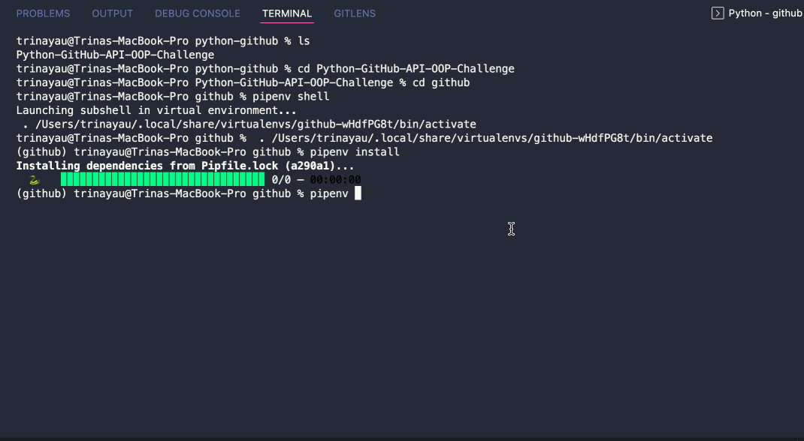

# Python OOP Challenge using GitHub API
First try at making a small Python CLI program using OOP learnt in today's Lap 4 Python learn week's class.
This was the brief:
- Create a CLI with an Object Oriented design
  - [x] On starting the app, User is asked for their GitHub username
  - [x] A request is made to `https://api.github.com/users/<username>/repos`
  - [x] API data is turned into instances of Repository class
  - [x] User is shown a numbered list their repos by name
  - [x] User can input a number to see more details on the corresponding repository

## Installation and Usage
### Installation
1. Clone the repo and open up new terminal
2. `cd github`
3. `pipenv shell`
4. `pipenv install` to install dependencies

### Usage
1. Type `pipenv run start` into terminal to start the CLI
2. Follow the inputs in the CLI!

## Final

